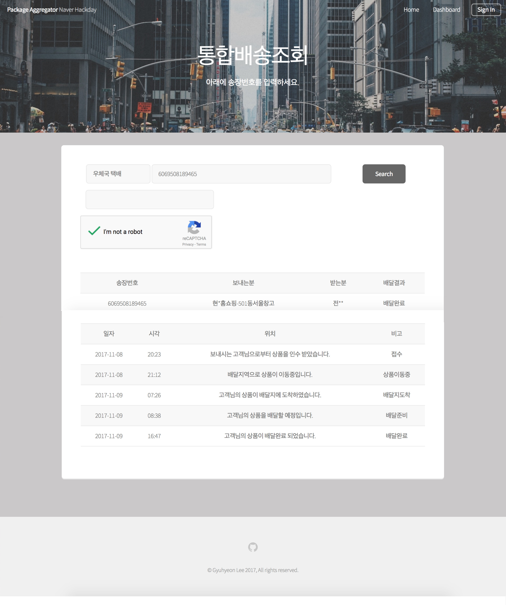
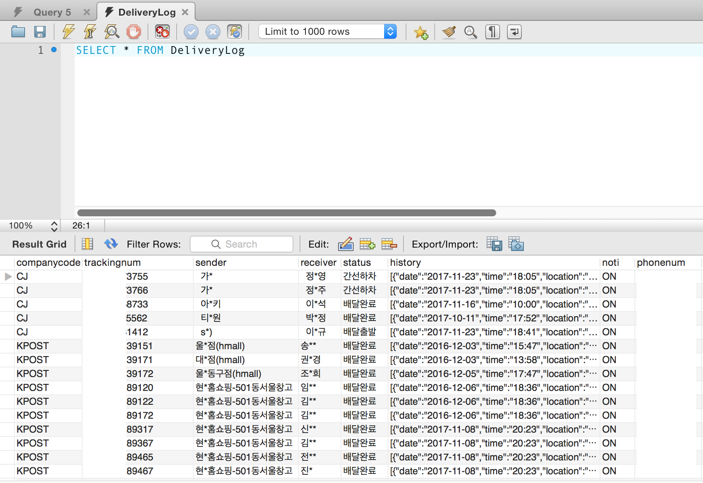
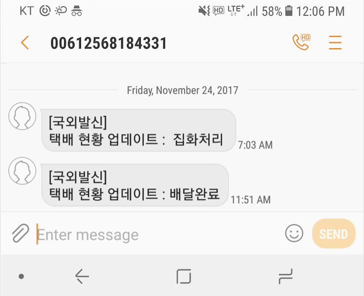

# Package_Aggregator : A consolidated package status tracker
Prepared for a 24hr Programming event [Naver Hack Day](https://github.com/NAVER-CAMPUS-HACKDAY/common).  

# About
Demo hosted at [naverhackday.xyz](http://naverhackday.xyz).  
  

- The server will probably be down after 2017/11/24 when the event ends and the [Ncloud](https://www.ncloud.com/) instance is terminated.  
- Uses Node.js & Express & ejs to serve frontend, frontend design is based on a copyright tranferred(purchased) Pixelarity template.  
- DB is MySQL.
- Uses Twilio API to provide SMS alert service when shipment tracking data is updated.
- Image below is the captured snapshot of the schema/tuples that were accumulated along the event.  
  
  

# Features
- Standardized the data model for shipment tracking.
  

  
- Provided a fully functional shipment tracking frontend service
(image of website included above, link is [naverhackday.xyz](http://naverhackday.xyz)).
- Provides a RESTful B2B platform for users that require just the parsed information without alert/table rendering services. The API spec can be viewed at [SwaggerUI](https://app.swaggerhub.com/apis/gyuhyeon5/PackageAggregator/1.0.0).  
- Provides an SMS alert system for subscribers if they want to be notified of changes :  
  
  


# How to use (db config required...)
```
sudo npm install
sudo npm install pm2 -g
sudo pm2 start app.js    # alternatively, node app.js - but it will terminate if nohup/other tools aren't used.
# Without a proper DB connection and a twilio account, SMS notification will not work.
# The crawling part will work 
```

# LICENSE
Copyright (c) 2017 Gyuhyeon Lee

Permission is hereby granted, free of charge, to any person obtaining a copy of this software and associated documentation files (the "Software"), to deal in the Software without restriction, including without limitation the rights to use, copy, modify, merge, publish, distribute, sublicense, and/or sell copies of the Software, and to permit persons to whom the Software is furnished to do so, subject to the following conditions:

The above copyright notice and this permission notice shall be included in all copies or substantial portions of the Software.

THE SOFTWARE IS PROVIDED "AS IS", WITHOUT WARRANTY OF ANY KIND, EXPRESS OR IMPLIED, INCLUDING BUT NOT LIMITED TO THE WARRANTIES OF MERCHANTABILITY, FITNESS FOR A PARTICULAR PURPOSE AND NONINFRINGEMENT. IN NO EVENT SHALL THE AUTHORS OR COPYRIGHT HOLDERS BE LIABLE FOR ANY CLAIM, DAMAGES OR OTHER LIABILITY, WHETHER IN AN ACTION OF CONTRACT, TORT OR OTHERWISE, ARISING FROM, OUT OF OR IN CONNECTION WITH THE SOFTWARE OR THE USE OR OTHER DEALINGS IN THE SOFTWARE.
