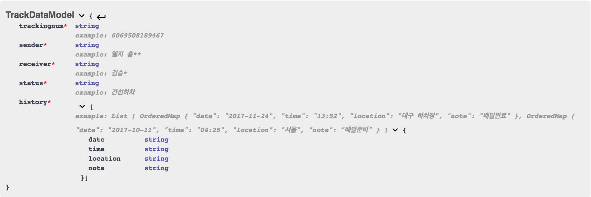

# Package_Aggregator : 다중 배송조회 서비스
24시간 네이버 [핵데이](https://github.com/NAVER-CAMPUS-HACKDAY/common) 행사를 통해 개발하였습니다.  
  
# Keywords (완료)
## 보안
- Google reCaptcha API
- regex (인젝션 방지)
## 서비스
- Twilio API (실시간 SMS 알림 서비스)
- 소비자 통합 배송조회 서비스 제공
- B2B REST 인터페이스 제공
## 구조
- 데이터 구조 설계
- OpenAPI
## 심미성
- 깔끔한 프론트엔드

# Backlog
- Travis/Jenkins CI 연계
- Dockerize
- Penetration testing
- 택배사/중계사 공식 API 사용하여 챗봇 서비스 개발
- 로그인 시스템 및 개인 대시보드 구현하여 본인 로그의 손쉬운 조회 및 관리(/login /dashboard route는 placeholder로 준비상태)
- 로그인 구현시 개인정보 암호화
  
# About
데모 링크는 다음과 같습니다 : [naverhackday.xyz](http://naverhackday.xyz).  
  

- 데모 링크 서버는 이벤트 종료 후 [Ncloud](https://www.ncloud.com/) 인스턴스가 삭제되면 사라집니다.
- Node.js & Express & ejs 스택으로 프론트엔드에 렌더링되어 제공됩니다. 배송정보의 경우는 jQuery ajax로 업데이트됩니다.  
- DB는 MySQL입니다.
- Twilio API로 사용자들에게 SMS 서비스를 제공합니다. 배송조회시 원하면 전화번호를 기입하여, 서버가 주기적으로(1회/30초) 크롤링하고 자체DB와 비교하여 변경사항이 있을 시 문자알림을 전송합니다.
- 아래 이미지는 본 행사기간동안 테스트/개발하며 구상하게 된 DB의 스키마 및 실제 정보 일부를 담고 있습니다.  
  
  

# Features
- 배송조회 결과 제공을 RESTful하게 할 수 있도록 하기 위해 결과 데이터의 모델링을 해보았습니다.
  

  
- 2개의 택배사를 모아 정상적으로 동작하는 검색 시스템을 구현하였습니다.
(해당 프론트엔드는 위에 캡쳐 첨부되어있고, [naverhackday.xyz](http://naverhackday.xyz))에서 확인해볼 수 있습니다..
- 비즈니스 사용자/개발자를 위한 RESTful한 API 창구를 별도로 만들었습니다. API상세는 [SwaggerUI](https://app.swaggerhub.com/apis/gyuhyeon5/PackageAggregator/1.0.0)에서 확인할 수 있으며, 이에 대한 웹사이트 route는 현재 [naverhackday.xyz/service/track](http://naverhackday.xyz/service/track)에서 제공되고 있습니다.  
- 변경사항이 있을 경우 알림을 받기 원한다면 SMS 알림 서비스를 제공합니다 :  
  
  


# 사용법 (DB 및 구글 리캡챠, Twilio API 설정 필요)
```
sudo npm install
sudo npm install pm2 -g
sudo pm2 start app.js    # node app.js도 가능하지만 프로세스가 bash shell 종료시 사라집니다.
# Twilio 및 mysql DB 설정 없이는 알람 서비스가 정상 작동하지 않습니다.
# 크롤링파트는 config.js만 root에 정상적으로 넣어놓으면 문제없이 작동합니다.
```

# LICENSE
Copyright (c) 2017 Gyuhyeon Lee

Permission is hereby granted, free of charge, to any person obtaining a copy of this software and associated documentation files (the "Software"), to deal in the Software without restriction, including without limitation the rights to use, copy, modify, merge, publish, distribute, sublicense, and/or sell copies of the Software, and to permit persons to whom the Software is furnished to do so, subject to the following conditions:

The above copyright notice and this permission notice shall be included in all copies or substantial portions of the Software.

THE SOFTWARE IS PROVIDED "AS IS", WITHOUT WARRANTY OF ANY KIND, EXPRESS OR IMPLIED, INCLUDING BUT NOT LIMITED TO THE WARRANTIES OF MERCHANTABILITY, FITNESS FOR A PARTICULAR PURPOSE AND NONINFRINGEMENT. IN NO EVENT SHALL THE AUTHORS OR COPYRIGHT HOLDERS BE LIABLE FOR ANY CLAIM, DAMAGES OR OTHER LIABILITY, WHETHER IN AN ACTION OF CONTRACT, TORT OR OTHERWISE, ARISING FROM, OUT OF OR IN CONNECTION WITH THE SOFTWARE OR THE USE OR OTHER DEALINGS IN THE SOFTWARE.
